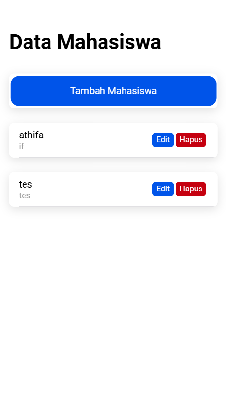
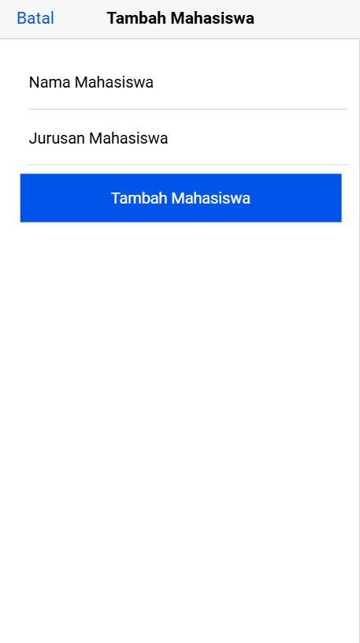
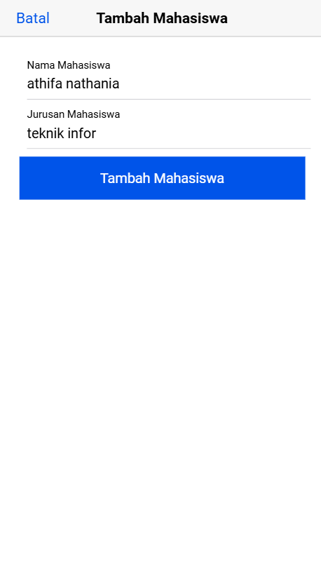
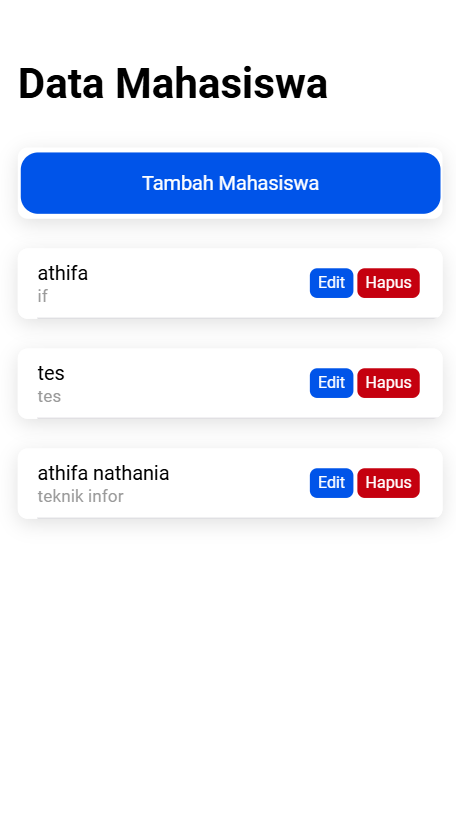
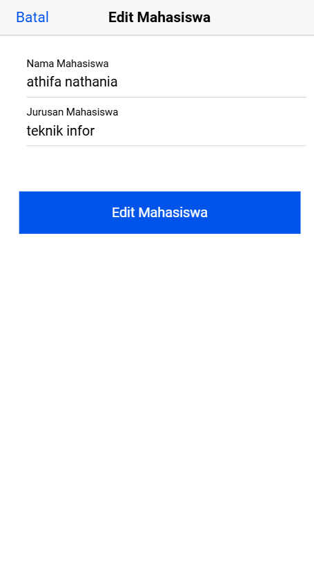
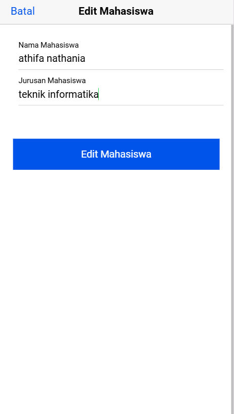
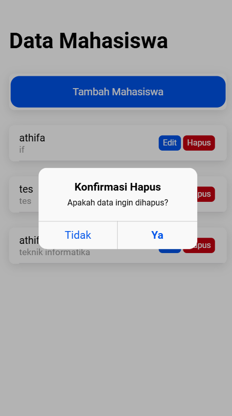
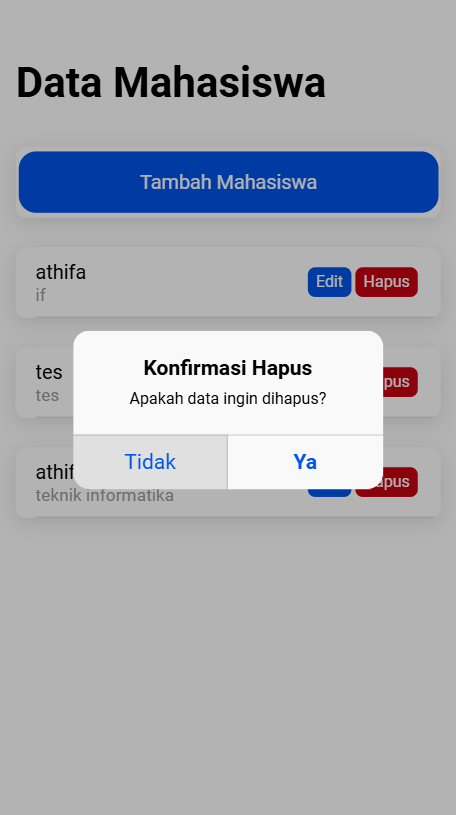
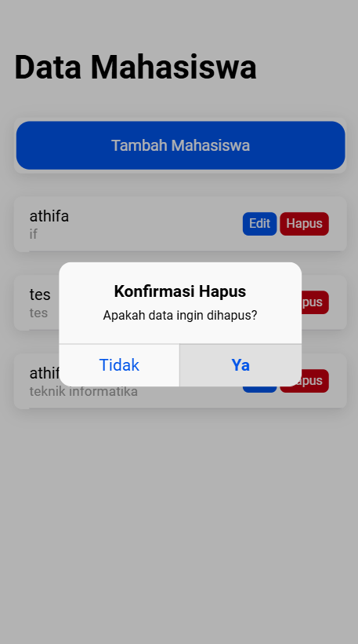
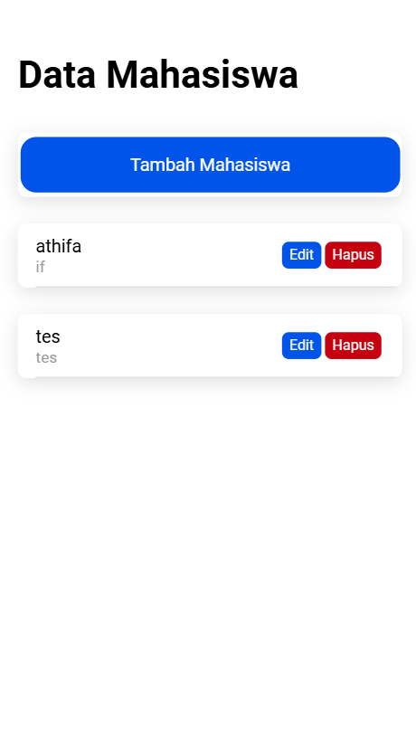

#### Nama       : Athifa Nathania  
#### NIM        : H1D022031  
#### Shift Baru : F
#### Shift Lama : D

---
# Tugas 8 - Cara Kerja Proses CRUD Data Mahasiswa - Ionic

### 1. Create (Tambah Data Mahasiswa)
- **Screenshot Tampilan**:
  - Ketika kita memilih tombol `Tambah Mahasiswa`

    
    maka:
  - *Screenshot awal* menunjukkan form "Tambah Mahasiswa" yang bisa diisi dengan data (nama dan jurusan). Disini saya menggunakan nama `athifa nathania` dan jurusan `teknik infor`
     
  - *Screenshot akhir* menunjukkan data berhasil ditambahkan ke dalam list.
    
- **Proses yang terjadi**:
  - Ketika tombol "Tambah Mahasiswa" ditekan, fungsi `openModalTambah(true)` dipanggil yang membuka modal input.
  - Fungsi `tambahMahasiswa()` dijalankan saat tombol konfirmasi ditekan. Fungsi ini memeriksa input dan mengirim data ke API menggunakan metode `tambah`.
  - Jika berhasil, data ditambahkan ke database, `getMahasiswa()` dipanggil ulang untuk memuat data terbaru, dan modal ditutup.
  ```typescript
  tambahMahasiswa() {
    if (this.nama !== '' && this.jurusan !== '') {
      let data = { nama: this.nama, jurusan: this.jurusan };
      this.api.tambah(data, 'tambah.php').subscribe({
        next: (hasil) => {
          this.resetModal();
          this.getMahasiswa();
          this.modalTambah = false;
          this.modal.dismiss();
        },
        error: () => { console.log('gagal tambah mahasiswa'); }
      });
    }
  }
  ```

### 2. Read (Tampilkan Data)
- **Screenshot Tampilan**:
  - Menunjukkan tampilan list data mahasiswa yang sudah ditambahkan. (ini tampilan sebelum di create data)
    
- **Proses yang terjadi**:
  - Fungsi `getMahasiswa()` dipanggil di `ngOnInit()` untuk mengambil data mahasiswa saat halaman pertama kali dimuat.
  - Metode `tampil` di `api` memanggil `tampil.php` dan hasilnya disimpan di `dataMahasiswa`.
  ```typescript
  getMahasiswa() {
    this.api.tampil('tampil.php').subscribe({
      next: (res) => { this.dataMahasiswa = res; },
      error: (err) => { console.log(err); }
    });
  }
  ```

### 3. Update (Edit Data Mahasiswa)
- **Screenshot Tampilan**:
  - *Screenshot awal* memperlihatkan form edit diisi dengan data yang diubah. Disini saya mengubah data jurusan yang tadinya `teknik infor` menjadi `teknik informatika`
     
  - *Screenshot akhir* menunjukkan data mahasiswa yang sudah diperbarui.
    
- **Proses yang terjadi**:
  - Saat tombol "Edit" ditekan, `openModalEdit(true, item.id)` dipanggil. Fungsi ini mengisi form dengan data mahasiswa yang diambil menggunakan `ambilMahasiswa()`.
  - Fungsi `editMahasiswa()` dipanggil untuk mengirim perubahan data ke API `edit.php`. Jika berhasil, data diperbarui dan halaman diperbarui dengan `getMahasiswa()`.
  ```typescript
  openModalEdit(isOpen: boolean, idget: any) {
    this.modalEdit = isOpen;
    this.id = idget;
    this.ambilMahasiswa(this.id);
  }

  editMahasiswa() {
    let data = { id: this.id, nama: this.nama, jurusan: this.jurusan };
    this.api.edit(data, 'edit.php').subscribe({
      next: () => {
        this.resetModal();
        this.getMahasiswa();
        this.modalEdit = false;
        this.modal.dismiss();
      },
      error: () => { console.log('gagal edit Mahasiswa'); }
    });
  }
  ```

### 4. Delete (Hapus Data Mahasiswa)
- **Screenshot Tampilan**:
  - *Screenshot awal* menunjukkan kotak dialog konfirmasi yang muncul saat pengguna menekan tombol "Hapus". Dialog ini memiliki dua opsi: "Tidak" dan "Ya".
    
  - *Screenshot tambahan* memperlihatkan bahwa saat tombol "Tidak" ditekan, penghapusan dibatalkan, dan tidak ada perubahan pada data mahasiswa.
    
  - *Screenshot akhir* menunjukkan hasil ketika tombol "Ya" ditekan, dan data berhasil dihapus dari list.
      

- **Proses yang terjadi**:
  - Saat tombol hapus ditekan, fungsi `hapusMahasiswa(id)` dipanggil yang menampilkan `AlertController` dengan pesan konfirmasi.
  - Jika pengguna memilih **"Tidak"**, handler `role: 'cancel'` diaktifkan, dan konsol menampilkan pesan *"Hapus dibatalkan"*. Tidak ada perubahan data.
  - Jika pengguna memilih **"Ya"**, handler pada tombol ini akan memanggil API `hapus` dan melanjutkan proses penghapusan data, diikuti pemanggilan `getMahasiswa()` untuk memuat ulang data terbaru.
  ```typescript
  async hapusMahasiswa(id: any) {
    const alert = await this.alertCtrl.create({
      header: 'Konfirmasi Hapus',
      message: 'Apakah data ingin dihapus?',
      buttons: [
        {
          text: 'Tidak',
          role: 'cancel',
          handler: () => {
            console.log('Hapus dibatalkan');
          }
        },
        {
          text: 'Ya',
          handler: () => {
            this.api.hapus(id, 'hapus.php?id=').subscribe({
              next: (res) => {
                this.getMahasiswa();
                console.log('berhasil hapus data');
              },
              error: (error) => {
                console.log('gagal');
              }
            });
          }
        }
      ]
    });

    await alert.present();
  }
  ```
